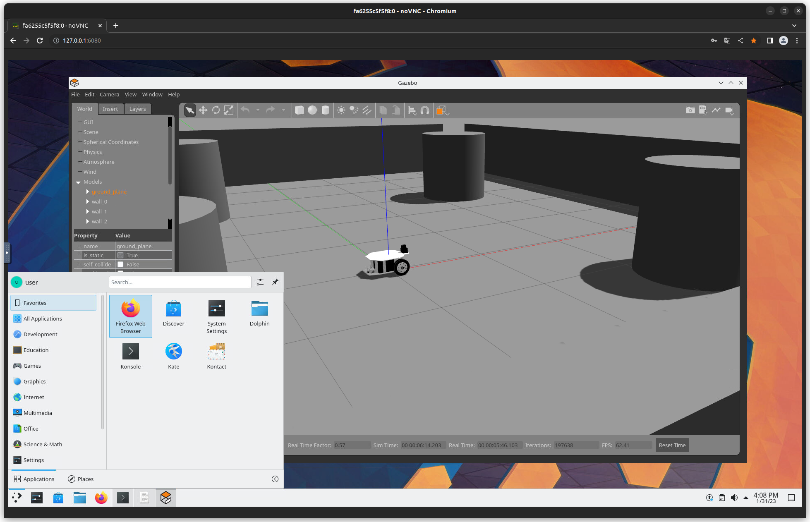

# nvidia-egl-desktop-with-ros
## Introduction

This is a Dockerfile to use ROS on KDE Plasma Desktop container with NVIDIA GPU.  
This Dockerfile is based on [selkies-project/docker-nvidia-egl-desktop](https://github.com/selkies-project/docker-nvidia-egl-desktop).



## Requirements

- NVIDIA graphics driver 450.80.02+ [^1]
- Docker
- nvidia-docker2

## Build docker image

```
cd humble # or noetic
./launch_container.sh build
```


## Launch docker container

Execute the command described below.  
If you customize setting, please read <https://github.com/selkies-project/docker-nvidia-egl-desktop/blob/main/README.md>.

```
./launch_container.sh setup
```

### Access KDE Plasma Desktop via web browser

Browse <http://127.0.0.1:uid/>.  
In this docker container, default account is `your login user name`.  

[^1]: <https://github.com/selkies-project/docker-nvidia-egl-desktop/blob/main/README.md>
